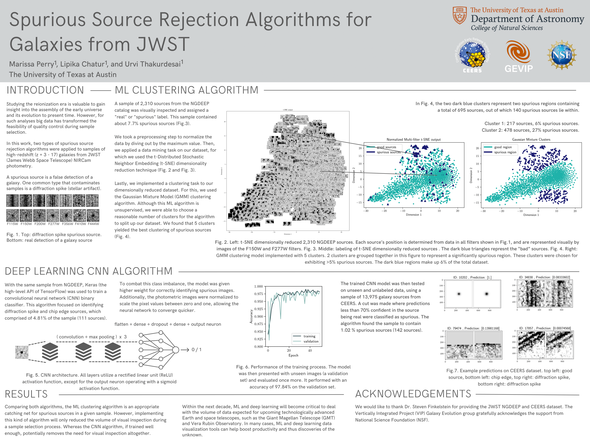

# Inspecting High-Redshift Galaxies from JWST Using Deep Learning

(https://sites.utexas.edu/vip/)

* Project at the University of Texas at Austin within the Galaxy Evolution Vertically Integrated Project (GEVIP) research group !
* Built a convolutional neural network (CNN) binary image classifier using Keras (high-level API of TensorFlow)
* Current accuracy obtained by the metric score is ~ 97%
* The algorithm was trained on a dataset of labelled photometrically imaged galaxies consisting of 2310 images

## Presented Work at UT Austin's Dept. of Astronomy Frank N. Bash Symposium (October, 2023)

